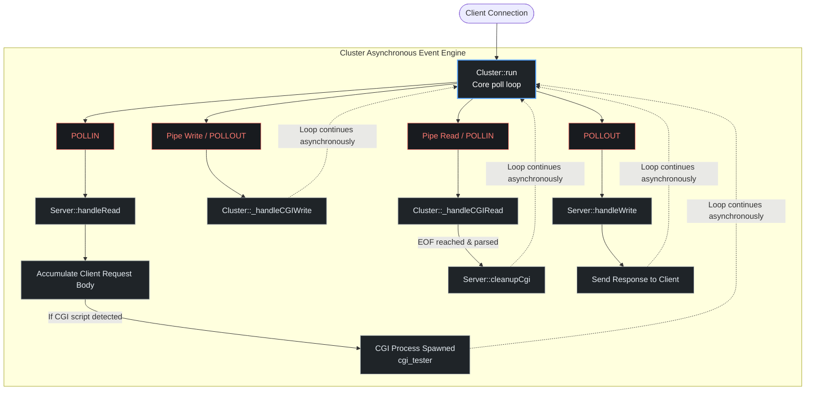

*This project has been created as part
of the 42 curriculum by **erazumov**, **esergeev** and **mchiacha***

# webserv — Non-Blocking HTTP/1.1 Server in C++98

## 📌 Project Overview

**webserv** is a simple HTTP/1.1 web server written in **C++98**. The goal of this project is to create a server like Nginx that can handle many clients at the same time using only one thread.

To achieve this, the server uses a single **`poll()`** loop. This loop monitors all file descriptors (both sockets and pipes) at the same time for reading and writing. Everything runs in **non-blocking mode** (`O_NONBLOCK`), meaning the server never freezes or waits for a slow client.

### ✨ Features

- **One Loop**: Uses only 1 `poll()` call to manage all network I/O operations.

- **Static Website**: Serves HTML, CSS, and images completely and smoothly.
- **HTTP Methods**: Fully supports `GET`, `POST`, and `DELETE` requests.
- **File Upload**: Allows clients to upload and save files on the server.
- **Directory Listing**: Automatically lists files in a folder (Autoindex) if enabled.
- **CGI Scripts**: Runs dynamic Python scripts using `fork()` and pipes without blocking the main server.
- **Resilience**: Hardened against crashes, handling abrupt disconnections or bad CGI scripts safely.

---

## 📐 Design Choices & Comparisons

Here is why we made specific technical choices in our architecture and how they compare to alternative methods.

### 1. Single-Thread Asynchronous vs Multi-Threaded (Apache style)

Instead of creating a new thread or process for every single client connection, we chose a single-threaded event loop driven by `poll()`.

| Feature | Our Single-Threaded Model (Nginx style) | Multi-Threaded Model (Apache style) |
| :--- | :--- | :--- |
| **Memory Usage** | **Very Low** (Shared memory space, lightweight arrays) | **High** (Each thread requires its own stack memory) |
| **Context Switching**| **Zero CPU waste** (No thread switching overhead) | **High CPU cost** (OS constantly swaps active threads) |
| **Data Safety** | **Safe** (No data races, no complex mutex locks needed) | **Complex** (High risk of deadlocks and race conditions) |

### 2. Why `poll()` instead of `select()`?

The subject allows `select()`, `poll()`, `epoll()`, or `kqueue()`. We selected `poll()` as the best balance for this project.

- **Why not `select()`?** `select()` has a hard limit of **1024** file descriptors maximum. If the server gets hit with massive traffic, it crashes or refuses connections. Also, managing bitmasks (`fd_set`) is less intuitive than arrays.

- **Why `poll()`?** It has **no hard limit** on file descriptors (it scales with system memory). It uses a simple vector array of `struct pollfd` which makes adding, tracking, and updating event flags (like `POLLIN` and `POLLOUT`) clean and direct.
- **Why not `epoll()` / `kqueue()`?** While `epoll` (Linux) and `kqueue` (macOS) are faster for thousands of connections, they are OS-specific. `poll()` is completely portable and cross-platform across all Unix environments.

### 3. Separation of Concerns (Modular Architecture)

We deliberately split the system into three fully decoupled layers:

1. **`Cluster`**: Only cares about raw file descriptors, system calls (`poll()`, `accept()`), and routing events. It has zero knowledge of HTTP formatting or Python.

2. **`Server`**: Only cares about the HTTP protocol. It receives raw byte buffers from the `Cluster`, uses `Request` to understand them, and prepares a `Response`.
3. **`CGI`**: Only cares about process isolation (`fork()`, `execve()`) and execution environment scripts.

> **💡 Key Benefit:** If we want to replace `poll()` with `epoll()` in the future, we only need to modify the `Cluster` class. The entire HTTP engine (`Server`) and the script engine (`CGI`) will remain completely untouched.

---

## 🏗️ Architecture & Data Flow

Our server is designed using a **modular architecture**. Each class has one specific job, making the code clean, easy to debug, and highly efficient.

### Core Classes Overview

- **`Cluster`**: The master engine of the server. It runs the main `poll()` loop, manages the array of all file descriptors, and accepts new clients. It does not know anything about HTTP; it only handles raw network events.

- **`Server`**: The brain of the HTTP logic. It receives raw data from the `Cluster`, routes the request to the correct folder, and coordinates the creation of the final response.

- **`Config` & `Location`**: The settings parser. They read the `default.conf` file and store rules like ports, allowed methods, and directory roots.
- **`Request`**: The parser machine. It takes the raw text bytes from the client socket, cuts it into pieces, and extracts the HTTP method (`GET`/`POST`/`DELETE`), the URL, and the headers.
- **`Response`**: The packager. It builds the official HTTP response string (headers + body content) to send back to the user's browser.
- **`CGI`**: The external script runner. It creates a child process (`fork()`) and executes the Python interpreter (`execve()`) to run dynamic scripts safely.

### Data Flow: How a Request Travels

Here is the exact journey of a request inside our class architecture:

1. **`Cluster`** catches a network event (`POLLIN`) on a listening socket -> calls `accept()` -> creates a new client socket and adds it to the `poll()` list.

2. **`Cluster`** detects data coming from the client -> reads the bytes and passes them to the matching **`Server`** instance.

3. **`Server`** uses **`Request`** to parse the raw text data into a structured format.
4. **`Server`** checks the **`Config` / `Location`** rules to find the requested file on the disk.
   - *If it is a static file (HTML/CSS):* **`Server`** reads it and populates **`Response`**.

   - *If it is a `.py` script:* **`Server`** starts **`CGI`**, which forks a child process to run Python. **`Cluster`** reads the script's output asynchronously from a pipe and hands it back to **`Server`**.
5. **`Server`** prepares the final **`Response`** object and tells **`Cluster`** that the client socket is ready for writing (`POLLOUT`).
6. **`Cluster`** activates `send()` to transmit the response bytes back to the browser, then cleans up the memory.



---

## 👥 Team Distribution & Project Modules

We divided the project into technical modules so the team could collaborate easily.

### Module 1: Network Engine & Event Loop

**Focus:** Infrastructure and `poll()`

- Manages server sockets, ports setup, and multiple virtual server bindings.

- Implements the central `poll()` event loop to check for reading and writing readiness.
- Handles client life-cycles and safely removes disconnected clients without breaking the loop array.

### Module 2: HTTP Parsing & Routing

**Focus:** Request, Response, and Configuration

- Parses the `default.conf` file to setup routes, error pages, and body size limits.

- Reads raw client data, parses HTTP headers (`GET`/`POST`/`DELETE`), and verifies limits.
- Creates valid HTTP responses with precise status codes and handles large file transmissions in small parts.

### Module 3: CGI Gateway (Dynamic Content)

**Focus:** Executing Scripts

- Detects `.py` files and runs them through isolated `fork()` and `execve()` system calls.

- Uses non-blocking UNIX pipes to pass the request body to the script and read back the output.
- Sets up the exact environment variables matrix needed for standard CGI communication.
- Parses the script's output headers (`Status`, `Content-Type`) before returning the response.

### Module 4: HTCPCP Protocol Integration (Protocol Extension)

**Focus:** Custom Error Boundaries & Semantic Compliance

- Extends the core routing engine to intercept specific semantic test patterns natively in memory.

- Implements specialised visual error templates for non-standard protocol behavior.
- Optimises connection lifecycles by immediately flushing simulated errors back to the multiplexer without exhausting real file-system stream descriptors.

---

## 📖 Documentation, Resources & AI Usage

### 1. Internal Reference Manuals

More detailed, low-level design specifications for this implementation are available in the `docs/` folder:

* `docs/HTTP.md` — In-depth analysis of HTTP parsing states, multi-server routing matrices, and compliant status token packaging.

* `docs/Event-Loop.md` — Structural tear-down of the non-blocking `poll()` cluster architecture and connection socket lifecycles.
* `docs/CGI.md` — Practical blueprint of process isolation, environment setups, and non-blocking stream parsing for `youpi.bla` scripts.

### 2. External Learning Resources

The foundational concepts behind our asynchronous architecture were built using these core system references:

* **Beej's Guide to Network Programming:** Used to safely implement network socket bindings, multiplexing states, and port address configurations.

* **IBM UNIX/Linux System Calls Reference:** Consulted for managing edge-case behaviors of `fcntl()` flags, non-blocking pipe limits, and child process inheritance.
* **RFC 2616 (HTTP/1.1):** Utilised to cross-verify mandatory protocol constraints, chunked payload formatting rules, and semantic error code definitions.

### 3. AI Assistance & Transparency Declaration

In alignment with modern coding standards and 42 evaluation policies, artificial intelligence (Large Language Models) was used as an interactive debugging and architecture simulator during this project's development.

* **Edge-Case Troubleshooting:** Utilised to simulate concurrent traffic spikes and trace elusive short-write overflows in system buffers under high load.

* **Log Diagnostics:** Employed to parser raw high-volume server debug outputs, accelerating the pinpointing of byte-drop deltas inside the CGI read boundary.
* **Documentation Automation:** Used to dynamically optimise layout formatting and compile scalable visual ASCII and Mermaid data-flow schemas.

---

## 🫖 Deep Dive: The 418 I'm a Teapot Easter Egg

**`418 I'm a teapot`**

### 1. The HTCPCP Protocol
The **Hyper Text Coffee Pot Control Protocol** (**HTCPCP**) is a tongue-in-cheek communication protocol designed for controlling, monitoring, and diagnosing networked coffee pots. Published as **RFC 2324** on April Fools' Day in 1998, it remains one of the internet's most famous collaborative pranks.

> **RFC 2324 States:** "Any attempt to request a breach of security or an un-supported operation on a teapot should result in an error. If the server is a teapot, but was requested to brew coffee, it MUST return status code `418 I'm a teapot`."

While primarily used as a historical Easter egg across major internet infrastructure—such as Google's dedicated teapot error page—this project treats the protocol extension as a serious semantic compliance test.

### 2. Implementation
Rather than just throwing a static string, our server handles this protocol expansion directly within the core architecture:

* **Custom Method Interception:** The parsing engine detects semantic testing patterns and non-standard HTTP tokens natively in memory.

* **Stream Optimisation:** When a simulated protocol error occurs, the server immediately flushes the specialised visual teapot template back to the multiplexer loop, preventing the unnecessary allocation of system file descriptors.

---

## 🧪 Quick Verification & Testing

You can instantly verify the server's asynchronous multiplexing, method handling, and compliance using standard network utilities. Run these commands from a separate terminal window while the server is active:

* **Test Core Asynchronous `GET` (Static Content):**
```bash
curl -v http://127.0.0.1:8080/
```

* **Test High-Volume `POST` Payload Processing (CGI Gateway):**

	Transmits a massive binary payload asynchronously down to the `cgi_tester` engine without interrupting other active connections.
	```bash
	curl -X POST -H "Content-Type: text/plain" --data-binary @largefile.txt http://127.0.0.1:8080/directory/youpi.bla
	```

* **Test File Deletion Capabilities (`DELETE` Method):**

	Safely removes an existing target asset from the storage directory.
	```bash
	curl -X DELETE http://127.0.0.1:8080/uploads/target_file.txt
	```

* **Test Protocol Extensions (HTCPCP Easter Egg):**

	Triggers the Hyper Text Coffee Pot Control Protocol natively in memory to yield a semantic error page.
	```bash
	curl -v -X BREW http://127.0.0.1:8080/
	```

---

## 🛠️ Instructions

### 1. Compilation

The project compiles strictly within the **C++98** standard framework using rigid error-checking flags (`-Wall -Wextra -Werror`) along with optimisation and debugging diagnostics (`-Og -g3`).

To build the executable, run the default rule from the project root:

```bash
make
```

### 2. Preparing the 42 Test Environment

Makefile includes a specialised target designed to seamlessly auto-provision the local file system with the exact scaffolding required by the official **École 42** cluster test suite.

To configure the **`YoupiBanane`** mock directories, file extensions, and target symbolic links, run:
```bash
make test
```

**What this does:** It dynamically spins up the `www/YoupiBanane/` sub-tree framework (including `nop/`, `Yeah/`, and `.bla` extension files) and generates safety symlinks directly in the root workspace so the `cgi_tester` binary functions flawlessly right out of the box.

### 3. Running the Server

Start the cluster engine by launching the compiled binary. You can pass a targeted configuration layout path or leave it blank to default to your baseline rule set:
```bash
./webserv [path_to_config.conf]
```

### 4. Maintenance & Diagnostic Rules

Manage build artifacts and system footprints using these dedicated development rules:

* **Remove Objects:** Strip away the compilation object folder (`objs/`) while leaving the server binary intact.
	```bash
	make clean
	```

* **Full Workspace Purge:** Wipe out all compiled objects, the main server executable, and the generated tester file system directory layouts to return to a pristine repository state.
	```bash
	make fclean
	```

* **High-Speed Recompilation:** Wipe and fully rebuild the codebase from scratch. This rule is optimised to automatically detect your system's hardware core maximums and run multi-threaded parallel compilation tasks simultaneously:
	```bash
	make re
	```