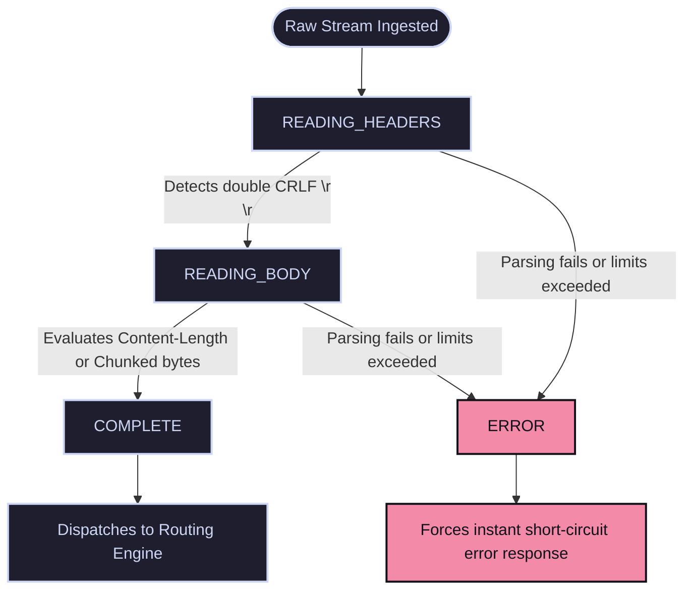

# HTTP Protocol Processing Engine & State Machine

This section provides an in-depth technical manual on how `webserv` ingests, parses, routes, and responds to HTTP/1.1 client requests using an asynchronous, non-blocking finite state machine.

---

## 1. Subsystem Architecture & Responsibilities

The HTTP processing engine is managed cooperatively by the `Server`, `Request`, and `Response` classes, with `Config` and `Location` providing structural constraint boundaries.

Its primary responsibilities include:
1. **Stream Accumulation:** Progressively ingesting raw, fragmented data packets from client sockets without blocking the thread.
2. **State Machine Parsing:** Progressively converting text streams into structured objects (validating request lines, headers, chunked data, and boundaries).
3. **Prefix Route Resolution:** Matching target URIs against configuration blocks to enforce method permissions, roots, body limits, and upload locations.
4. **Spec-Compliant Response Building:** Assembling standard status lines, dynamic headers, and files/payload bodies into a standard HTTP packet stream.

---

## 2. Inbound Request Parsing State Machine (`Request`)

When `Cluster` registers a `POLLIN` event on a client socket, it delegates processing to `Server::handleRead()`, which extracts bytes non-blockingly using `recv()` and passes them into the client's specific `Request` tracking instance.

The `Request` object evaluates the stream sequentially using a finite state machine composed of four discrete states:



### State Breakdowns:
* **`READING_HEADERS`:** Parses the HTTP Request Line (`METHOD PATH VERSION`) and greedily constructs a map of header key-value arrays.
  * *Transition Trigger:* The parser continuously scans for the double carriage-return line-feed delimiter (`\r\n\r\n`) which signals the absolute boundary of the header block. Once found, it extracts critical structural headers like `Content-Length` or `Transfer-Encoding: chunked` and shifts state.
* **`READING_BODY`:** If a payload size or chunked flag is declared, the machine monitors the incoming stream, counting bytes until the specified limit is reached.
* **`COMPLETE`:** The payload and headers have safely cleared parsing boundaries and are ready to be dispatched to the route execution layers.
* **`ERROR`:** If the request line violates standard formats, if necessary headers are missing, or if limits are breached, parsing short-circuits to halt downstream processing.

---

## 3. Configuration Matching & Route Resolution

Once the `Request` reaches the `COMPLETE` state, the `Server` executes route mapping via the `Config` hierarchy.

### Longest Prefix Matching
The routing engine evaluates the incoming request URI against all configured `Location` context blocks. It implements a *longest prefix match* algorithm to locate the most specific rule. For example, a request for `/directory/nop/file.html` will prefer a location block defined for `/directory/nop` over a generic block for `/`.

### Enforced Location Directives
The matched `Location` entry acts as an administrative gateway, validating:
* **`allow_methods`:** If the incoming method (e.g., `POST`) is not explicitly permitted by the rule, routing immediately aborts, generating a `405 Method Not Allowed` fault.
* **`client_max_body_size`:** If the parsed body size exceeds this threshold, ingestion breaks and outputs a `413 Payload Too Large` error.
* **Path Translation (`root` / `index`):** Translates the virtual URI into a concrete physical filesystem path by stitching the matching root path to the request trail.

---

## 4. HTTP Method Architecture

### GET Handling
If the target path maps to a standard file, the server reads it into memory and sets up the response payload. If the path points to a directory:
1. It attempts to append and serve a configured static file index (e.g., `index.html`).
2. If no index file is present on the disk, it evaluates the `autoindex` flag. If enabled, the server dynamically compiles a custom HTML directory listing on the fly and returns it. If disabled, it safely issues a `403 Forbidden` response.

### HEAD Handling
Executes an identical filesystem resolution and header verification lifecycle as a `GET` request. However, right before assembling the final payload string, the server calls **`Response::clearBodyForHead()`**, which entirely purges the internal `_body` string container. This ensures that all standard metadata headers remain completely intact and identical to a `GET` trace, while satisfying the requirement that no body bytes are sent to the client.

### POST Handling
- **File Upload Store:** If a `Location` directive specifies an `upload_store` directory, the incoming `Request::getBody()` payload is stored directly to that location on disk under the filename specified in the path mapping. Upon successful file creation, it issues a `201 Created` status line.
- **CGI Execution:** If the path targets a script extension matched to an executable interpreter (e.g., `.bla`), routing transfers data stewardship over to the isolated CGI engine rather than performing file logging.

### DELETE Handling
The engine maps the resource target and validates its existence. If the file exists and has valid write permissions, the server invokes the system level **`unlink()`** call to erase the file from the disk, returning a `200 OK` status upon successful deletion. If the file is missing, a standard `404 Not Found` page is issued.

### Built-in Easter Egg Rules
The routing system maintains an internal built-in rule mapping requests destined for `/coffee` directly to a **`418 I'm a teapot`** status code, returning a specialized error page complete with a custom status phrase.

---

## 5. Non-Blocking Response Assembly & Transmission

The `Response` class compiles HTTP data structures into standard text packets using a tightly controlled serialization layer.

### Structured Payload Generation (`Response::build`)
The `Response::build()` method handles response generation by sequential concatenation into a `std::stringstream`:
1. **Status-Line Assembly:** Consolidates the HTTP version, status code variable `_status`, and pairs it with its textual reason phrase via `_getReasonPhrase(_status)` (e.g., `HTTP/1.1 200 OK\r\n`).
2. **Server Identity:** Appends a hardcoded identification header (`Server: webserv/1.0 (42 Paris)\r\n`).
3. **Custom Headers Map:** Iterates over the internal `std::map<std::string, std::string> _headers` array, translating key-value pairings directly into standard `Key: Value\r\n` format rows.
4. **The Core Boundary:** Injects a mandatory empty line break (`\r\n`), which establishes the formal boundary separating headers from body space.
5. **Body Ingestion:** Appends the raw string data stored inside `_body`.

```cpp
// Content-Length Integrity Automation
void Response::setBody(std::string body) {
    _body = body;
    if (_status != Http::NO_CONTENT && (_status < 300 || _status >= 400) && _status != Http::NOT_MODIFIED) {
        std::stringstream ss;
        ss << _body.size();
        setHeader("Content-Length", ss.str());
    } else {
        setHeader("Content-Length", "0"); // Enforced 0 length for 204, 304, and redirects
    }
}
```